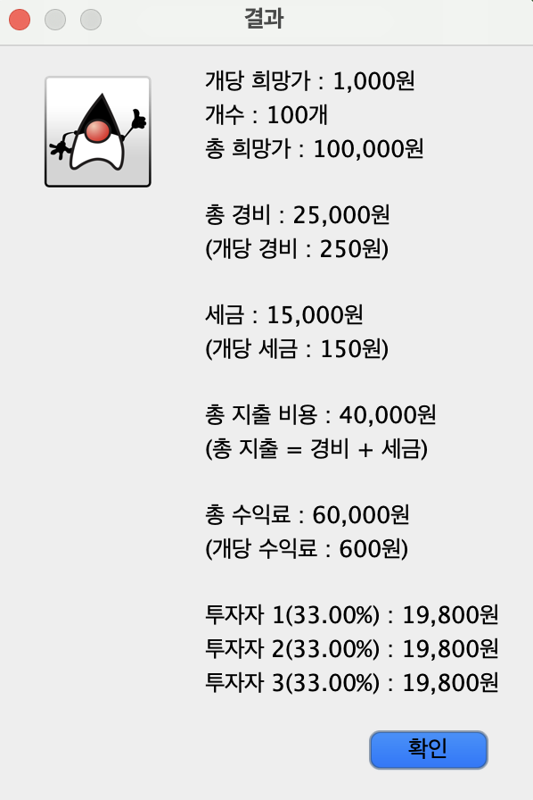
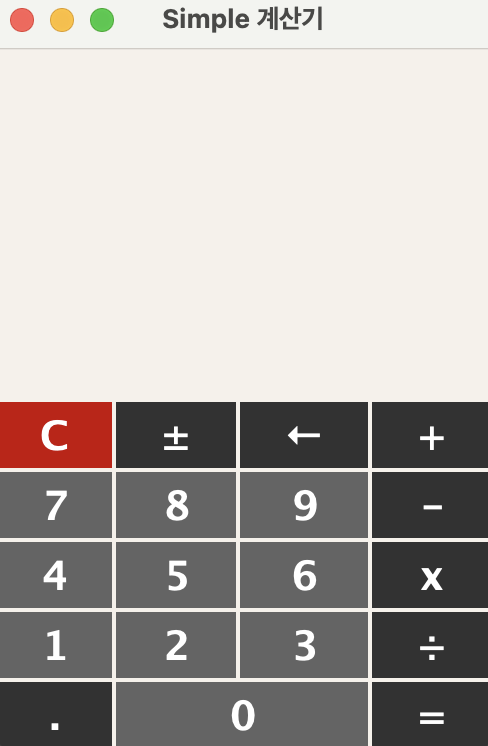

# Java Profit & Standard Calculator

## Project Overview
This project includes **two types of calculators** developed using **Java & javax** in Korean.

1️⃣ **Profit Calculator**  
   - Calculates **actual profit**based on the unit selling price, unit cost, quantity, tax rate, number of investors, and equity distribution.
   - Helps business owners easily determine **net profit** when selling products.

2️⃣ **Standard Calculator**  
   - A basic calculator that performs arithmetic operations (+, -, ×, ÷) and simple mathematical calculations.

---

## ✨ Key Features
### ✅ **Profit Calculator**
- **Input selling price, costs, and tax** → **Calculate actual profit**
- Calculates **profit distribution based on investor equity**
- Designed to easily identify the **break-even point**

### ✅ **Standard Calculator**
- Supports addition, subtraction, multiplication, and division
- `C`(clear), `←`(delete), and `±`(toggle sign) buttons
- Automatically computes expressions when `=` is pressed

---

## 📜 Screenshots

---

## 📜 License
This project is licensed under the MIT License.
You are free to modify and distribute it as long as you provide proper attribution to the original author.

---

## 📞 **Contact**
For questions or support, please contact:
- **Developer**: Jayden Kim
- **Email**: jayden0kim@gmail.com
- **GitHub**: WH0ISWHO